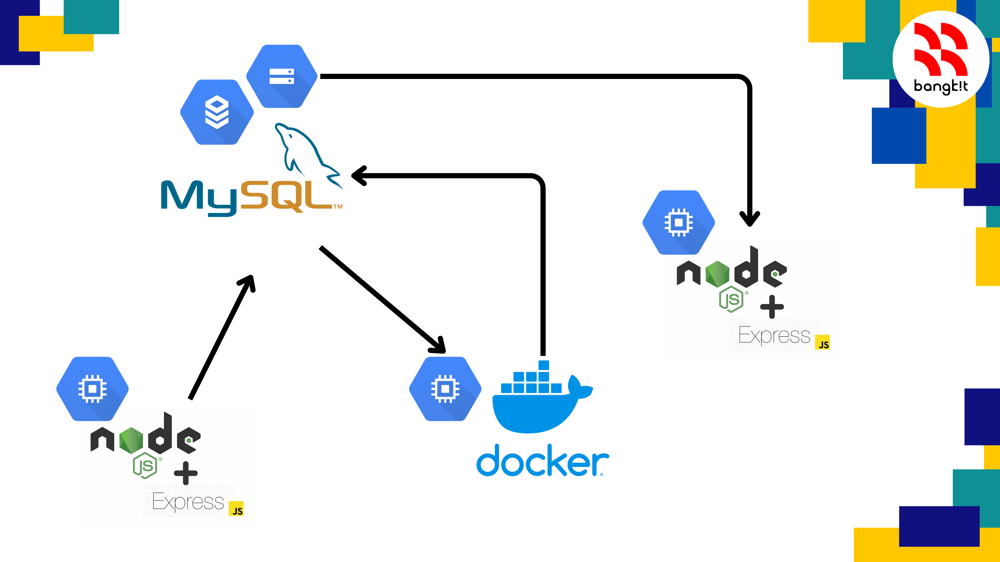

# CAPSTONE API - CC 

## GlucoPal Deploy App Documentation
---
#### Google Cloud Service
​Our Google Cloud Service uses the following services as our infrastructure:
* Compute Engine: this service runs the backend and machine learning models.
* Cloud SQL (MySQL): we use this service to store data from nutrition fact scans, food data, glycemic index data, glycemic load calculation results, and user history.
* Cloud Storage: we use this service to store SQL that we have created using a local computer.
---

#### Deployment
Following are the steps for deploying our application on the Google Cloud Platform:
1. First, we built the API using a local server, setting up user routes and testing Postman with a local URL.
2. After that, we created a virtual machine instance with the Linux operating system on Google Compute Engine.
3. We installed docker-compose and pm2; Node.js and Express JS is already available on our virtual machine.
4. Then, we created a Google Cloud Storage Bucket and Google Cloud SQL using MySQL as the DBMS.
5. We upload the local database export results to Google Storage Bucket to import them into Cloud SQL.
6. Then, we note down the Cloud SQL server IP and set our env according to the Cloud server.
7. Next, we use GitHub to deploy the API and machine learning model so that the virtual machine can perform git pulls from the GitHub project.
8. Then, we pull the API and Model repository. We use docker-compose to build docker to run machine learning models.
9. After that, we move to the API folder and run the API with pm2.
10. We set the URL in Postman using an external virtual machine IP so that fellow mobile developers can do testing.
---
#### API Endpoint
```
POST Register -> /register
```
```
POST Login -> /login
```
```
GET AllFood -> /allfood
```
```
POST Scan -> /scan/:id_users
```
```
GET History -> /history/:id_users
```
```
GET Result -> /result/:id
```
```
DELETE History -> /history/:resuldId
```
---
#### API Documentation
Follow this link : [GlucoPal-API Documentation](https://docs.google.com/document/d/1KCHKgnkhBPUZgBfTff7au2YkiAGYoQoxin4eBfa0Xks/edit?usp=sharing)
